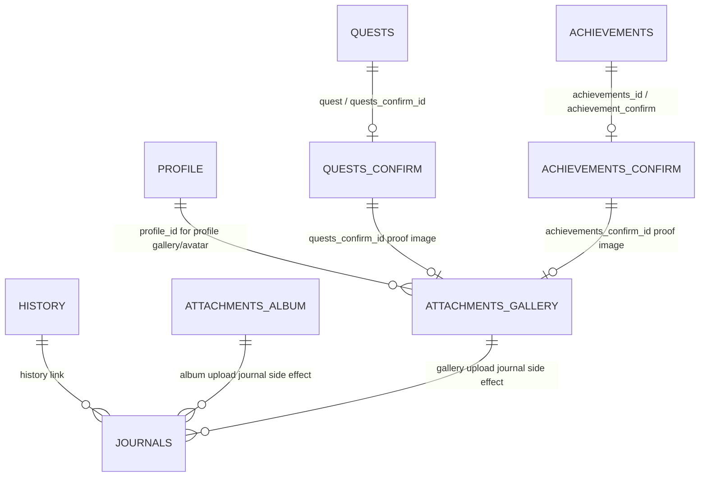

# NocoDB Database Architecture

## Purpose

This document explains the current NocoDB database structure used by Meo's Journey. It focuses on table responsibilities, important fields, relationships, environment differences, image storage behavior, and constraints that must be preserved when changing the app.

NocoDB is the primary runtime data source. The React app talks to NocoDB through `src/services/nocodb/`. The local NocoDB MCP server can be used by agents for live inspection, but application runtime code should continue using the service helpers.

## Service Entry Points

```text
src/services/nocodb.js
`-- barrel export for:
    |-- core.js
    |-- profile.js
    |-- journals.js
    |-- quests.js
    |-- achievements.js
    |-- pet.js
    |-- events.js
    `-- media.js
```

| File | Responsibility |
| --- | --- |
| `core.js` | Environment table IDs, base request wrapper, retry, throttling, deduplication, timestamp helpers. |
| `profile.js` | Status, profile, config, profile XP, and status updates. |
| `journals.js` | Journal/history read and write operations. |
| `quests.js` | Quest, quest confirmation, quest image upload, quest approval data. |
| `achievements.js` | Achievement, achievement confirmation, achievement image upload, achievement approval data. |
| `pet.js` | Pet inventory and pet status records. |
| `events.js` | Shared app event-state records, including pet events. |
| `media.js` | Profile gallery, home gallery, photo album, and NocoDB storage upload handling. |

## Environment Table Sets

The app uses different physical NocoDB table IDs per Vite mode.

| Logical Table | Development | Staging | Production |
| --- | --- | --- | --- |
| `STATUS` | `myzr03ds9q74zkp` | `ms8en1op7vwznus` | `m0ik9l51n1dpn5a` |
| `PROFILE` | `m05nuwsedf20qp3` | `mntx3zoatts0mqs` | `mzm3hqgjmjh1mwz` |
| `CONFIG` | `mes7u9lklksi0eh` | `mfknw80a7z9yq4k` | `m6ylndnmg21ecr2` |
| `HISTORY` | `m4k0ibuhxemhz7l` | `m6gg7iz2652psmg` | `me4mvbozt7qzr8u` |
| `JOURNALS` | `medcjhz2xd8ynxw` | `m2vhvjmajhe57m1` | `mijt02urzahbr2g` |
| `QUESTS` | `mc8ntiumxfjxso1` | `m5zdtosf0at9r5e` | `m2l33arlwkxniov` |
| `QUESTS_CONFIRM` | `mt2865bgwsejxhz` | `m9mcryxflb74irn` | `muv829m3xzzcvm7` |
| `ACHIEVEMENTS` | `mbvnmjgyovlitbc` | `mn5q6w7t05bamhd` | `m4m6vrb5ylqoqxn` |
| `ACHIEVEMENTS_CONFIRM` | `mv0l9jz8fhf1gjl` | `mlayyfujdqnghzb` | `mcynwxx2hpgcolt` |
| `ATTACHMENTS_GALLERY` | `mpp72hgqxpn2p3k` | `mc8mv7di4aadfz1` | `mirssuqhjx529p5` |
| `ATTACHMENTS_ALBUM` | `mkwz7hrtyzkvji6` | `mi5yptema60aqcq` | `mc6wu0v542g2bnr` |
| `PET` | `null` | `mubxl2iof13o7de` | `m5o1zjxu784d955` |
| `EVENTS` | `null` | `m321slymq8whnye` | `mumk1fgly3ngyfw` |

`staging` is treated as production-like for image behavior. Do not use development image assumptions in staging.

## Logical Data Model



NocoDB relationship fields are environment-sensitive. Production and staging have the expected foreign key fields. Development may lack some `<prefix>_id` fields, so development logic sometimes falls back to `Id` or recent-record fetches.

## Core Tables

### `STATUS`

Represents the current status shown on the home page.

| Field | Purpose |
| --- | --- |
| `Id` | NocoDB record ID. |
| `current_activity` | JSON/array of activity strings. Frontend maps this to `doing`. |
| `mood` | JSON/array of mood strings. |
| `location` | JSON/array of location strings. |
| `CreatedAt`, `UpdatedAt` | NocoDB timestamps used for status display freshness. |

Constraints:

- There is expected to be one active status record.
- Updates patch the existing record; they do not create new status records.
- New status values are prepended and duplicate values are removed case-insensitively.
- Status journal history is written separately into `JOURNALS`.

### `PROFILE`

Represents the main character profile and XP state.

| Field | Purpose |
| --- | --- |
| `Id` | NocoDB record ID. |
| `name` / `title` | Character display name fallback chain. |
| `caption` | Short profile caption. |
| `introduce` | Profile intro text. |
| `hobbies` | JSON/array of hobby strings. |
| `skills` | JSON/array of skill strings. |
| `social_link` | Array of one-key objects that becomes a frontend object. |
| `current_xp` | Current XP. |
| `max_xp` | XP threshold for current level. |
| `level` | Current level. |
| `CreatedAt`, `UpdatedAt` | NocoDB timestamps. |

Constraints:

- There is expected to be one active profile record.
- XP updates patch `current_xp`, `level`, and `max_xp`.
- Level-up uses `CONFIG.level_grow_rate` and `CONFIG.xp_multiplier`.
- Profile avatar/gallery images are stored in `ATTACHMENTS_GALLERY`, not directly in `PROFILE`.

### `PET`

Stores pet-page inventory and status.

| Field | Purpose |
| --- | --- |
| `food` | JSON array of pet food inventory items. |
| `care` | JSON array of pet care inventory items. |
| `status_health`, `status_hunger`, `status_sanity` | Numeric pet status values. |
| `last_status_tick_at` | Last timestamp used for elapsed-time status decay. |

Constraints:

- There is expected to be one active pet record with `Title = pet`.
- Pet event state is stored in `EVENTS`, not in this table.

### `EVENTS`

Stores lightweight event state for the app.

| Field | Purpose |
| --- | --- |
| `title` | Event state namespace. `events` is used for pet-page events. |
| `mosquito` | JSON object containing mosquito event state. |

Mosquito event-state shape:

```json
{
  "clearedDate": "2026-05-20",
  "completedAt": "2026-05-20T22:13:00.000+07:00"
}
```

Constraints:

- Keep pet event state in the `title = events` record.
- The `mosquito` field stores daily mosquito event completion status.
- Mosquito event runs during two time windows: **18:00-23:59** (evening) and **00:00-03:00** (night).
- Event resets daily and can only be completed once per day.
- Do not store event state in `PET.food` or `PET.care`.

### `CONFIG`

Stores operational app settings.

| Field | Purpose |
| --- | --- |
| `Id` | NocoDB record ID. |
| `auto_approve_tasks` | Enables auto-approval logic for eligible task submissions. |
| `level_grow_rate` | Percentage increase for `max_xp` after level up. |
| `xp_multiplier` | Multiplier applied before XP is added. |
| `pw_daily_update` | Password for protected user update access. |
| `version` | App/data version label. |

Constraints:

- There is expected to be one active config record.
- `auto_approve_tasks` is patched in place by admin actions.

## Journal Tables

### `HISTORY`

Groups journal entries by day.

| Field | Purpose |
| --- | --- |
| `Id` | NocoDB record ID. |
| `title` | Daily key, usually `history_YYYY-MM-DD`. |
| `created_time` | Date string for the history day. |

Constraints:

- Journal writes check whether today's history record exists.
- If missing, the app creates it before creating the journal.
- Journal writes can proceed without history if history linking fails.

### `JOURNALS`

Stores journal timeline records.

| Field | Purpose |
| --- | --- |
| `Id` | NocoDB record ID. |
| `title` | Unique journal title such as `journal_YYYY-MM-DD_HH-mm-ss-random`. |
| `caption` | Journal content. |
| `created_time` | ICT timestamp with `+07:00` offset. |
| `history` | Link to the related `HISTORY` record when available. |

Constraints:

- `created_time` should use ICT/UTC+7 formatting.
- Titles include random digits or milliseconds to avoid duplicate-key collisions.
- Status submit history is grouped into one journal record with multiple lines.
- Album/gallery uploads create journal records with `[Album Update]` or `[Gallery Update]` captions.

## Quest Tables

### `QUESTS`

Stores available quests.

| Field | Purpose |
| --- | --- |
| `Id` | NocoDB record ID. |
| `title` | Generated quest title. |
| `quest_name` | Localized array, usually `[{ en }, { vi }]`. |
| `desc` | Localized array, usually `[{ en }, { vi }]`. |
| `xp` | XP reward. |
| `created_time` | ICT creation timestamp. |
| `completed_time` | Completion timestamp when approved/completed. |
| `schedule_enabled` | Enables daily scheduling behavior. |
| `schedule_time` | Scheduled time if scheduling is enabled. |
| `quests_confirm_id` / link field | Relationship to confirmation record depending on schema. |

Constraints:

- English and Vietnamese names are required when creating quests.
- Descriptions are stored as localized arrays, not flat strings.
- Overdue logic compares `created_time` to today's ICT date.
- Completion patches `completed_time`; it does not rewrite core quest content.

### `QUESTS_CONFIRM`

Stores user submissions for quest completion.

| Field | Purpose |
| --- | --- |
| `Id` | NocoDB record ID. |
| `title` | Generated confirmation title. |
| `quest_name` | Submitted quest name snapshot. |
| `desc` | User submission description. |
| `created_time` | ICT creation timestamp. |
| `quest` / `quests_id` | Link or foreign key to `QUESTS`. |
| `status` | `pending`, `completed`, or `failed`. |

Constraints:

- A quest confirmation requires a quest ID.
- Initial status is normally `pending`.
- If auto-approve is enabled and the quest is not overdue, initial status can be `completed`.
- If auto-approve is enabled but the quest is overdue, initial status becomes `failed`.
- Proof image data is not stored directly here; it is linked through `ATTACHMENTS_GALLERY`.

## Achievement Tables

### `ACHIEVEMENTS`

Stores available achievements.

| Field | Purpose |
| --- | --- |
| `Id` | NocoDB record ID. |
| `title` | Generated achievement title. |
| `achievement_name` | Localized array, usually `[{ en }, { vi }]`. |
| `desc` | Localized array, usually `[{ en }, { vi }]`. |
| `special_reward` | Optional localized reward array. |
| `icon` | Icon key/string for display. |
| `xp` | XP reward. |
| `due_date` | Optional due date. |
| `created_time` | ICT creation timestamp. |
| `completed_time` | Completion timestamp when approved/completed. |
| `achievement_confirm` / link field | Relationship to confirmation record depending on schema. |

Constraints:

- English and Vietnamese names are required when creating achievements.
- `special_reward` is optional.
- Due dates are interpreted against ICT date logic for overdue checks.
- Completion patches `completed_time`.

### `ACHIEVEMENTS_CONFIRM`

Stores user submissions for achievement completion.

| Field | Purpose |
| --- | --- |
| `Id` | NocoDB record ID. |
| `title` | Generated confirmation title. |
| `achievement_name` | Submitted achievement name snapshot. |
| `desc` | User submission description. |
| `created_time` | ICT creation timestamp. |
| `achievements_id` | Foreign key to `ACHIEVEMENTS`. |
| `status` | `pending`, `completed`, or `failed`. |

Constraints:

- An achievement confirmation requires an achievement ID.
- If auto-approve is enabled and the achievement is not overdue, initial status can be `completed`.
- If due date exists and is overdue, auto-approved submission becomes `failed`.
- Proof image data is linked through `ATTACHMENTS_GALLERY`.

## Attachment Tables

### `ATTACHMENTS_GALLERY`

Shared attachment table for profile avatar/gallery images, home gallery records, and task proof images.

| Field | Purpose |
| --- | --- |
| `Id` | NocoDB record ID. |
| `title` | Generated title. Gallery records include `gallery` in the title. |
| `desc` | Optional gallery description. |
| `img_bw` | NocoDB file/image array. May be returned as an array or JSON string. |
| `created_time` | Creation timestamp for gallery-style records. |
| `profile_id` | Production/staging FK to `PROFILE` for profile gallery/avatar. |
| `quests_confirm_id` | FK to `QUESTS_CONFIRM` for quest proof image. |
| `achievements_confirm_id` | FK to `ACHIEVEMENTS_CONFIRM` for achievement proof image. |

Constraints:

- One-to-one task proof relationships must be linked by writing the FK field directly on `ATTACHMENTS_GALLERY`.
- Do not write the LinkToAnotherRecord display field for one-to-one links.
- Gallery records are standalone and are detected by `title` containing `gallery`.
- `img_bw` must be parsed defensively because NocoDB may return it as a JSON string.
- For S3-backed storage, prefer `signedUrl`.

### `ATTACHMENTS_ALBUM`

Stores photo album records.

| Field | Purpose |
| --- | --- |
| `Id` | NocoDB record ID. |
| `desc` | Optional album note/description. Empty string is allowed. |
| `img` | NocoDB file/image array for album images. |
| `created_time` | ICT timestamp. |

Constraints:

- At least one image is required to create an album.
- Empty album descriptions are valid data.
- UI should still render the note area and date/time when `desc` is empty.
- Album uploads create a journal side effect.

## Relationship Rules

### One-to-One NocoDB Links

For one-to-one relationships where `ATTACHMENTS_GALLERY` is the belongs-to side, update the FK field directly:

```javascript
await nocoRequest(`${TABLE_IDS.ATTACHMENTS_GALLERY}/records`, {
  method: 'PATCH',
  body: JSON.stringify([{
    Id: attachmentId,
    quests_confirm_id: questConfirmId
  }])
});
```

Do not write these values:

```javascript
quest_confirm: [questConfirmId]
quest_confirm: questConfirmId
```

Use the same rule for achievement proof images:

```javascript
achievements_confirm_id: achievementConfirmId
```

## Image Loading Rules

NocoDB image/file fields may contain file objects with different URL shapes.

| Mode | Preferred Fields | Behavior |
| --- | --- | --- |
| `development` | `signedPath`, `path`, `url` | Construct full URL with `VITE_NOCODB_BASE_URL` when needed. |
| `staging` | `signedUrl`, `url` | Use signed URL directly. |
| `production` | `signedUrl`, `url` | Use signed URL directly. |

Avoid relying on nested relationship queries for images when the relationship returns partial or stringified file data. Prefer separate fetches and map-based joins.

## Request and Rate-Limit Constraints

All NocoDB API calls go through `nocoRequest`.

Current safeguards:

- `xc-token` is attached from `VITE_NOCODB_TOKEN`.
- Request concurrency is limited.
- Requests are throttled between calls.
- `429` responses use exponential backoff and persisted penalty windows.
- In-flight duplicate requests are deduplicated by key.
- Errors include method, status, URL, and parsed error details where possible.

Do not bypass `nocoRequest` for table API calls. Direct `fetch` is only used for NocoDB storage uploads.

## Storage Upload Flow

Common media upload pattern:

1. Validate image files.
2. Upload files to `/api/v2/storage/upload` with `xc-token`.
3. Receive NocoDB file object array.
4. Create or patch the table record with `img`, `img_bw`, or related file field.
5. Link related confirmation records through FK fields when needed.
6. Create journal side effects for album/gallery uploads when applicable.

## Data Integrity Constraints

Preserve these behaviors unless a migration is explicitly planned:

- Do not rename logical table keys in `TABLE_IDS`.
- Keep separate table IDs for development, staging, and production.
- Keep staging using production-style signed URL logic.
- Do not move status/journal data into a new structure.
- Keep status updates as patches to the single status record.
- Keep status change journals grouped into one journal record per submit.
- Keep quest and achievement localized fields as arrays of language objects.
- Keep confirmation statuses limited to `pending`, `completed`, and `failed`.
- Keep proof images linked from `ATTACHMENTS_GALLERY` through FK fields.
- Treat empty album/gallery descriptions as valid records.

## Agent Access

NocoDB MCP is configured locally as `nocodb-meosjourney` for Claude/Codex. Use it for:

- live schema inspection
- verifying table fields
- checking specific records
- validating relationship field names
- confirming production/staging data behavior before risky changes

Do not use MCP to write, update, or delete data unless the user has confirmed:

- target environment
- target table
- target record(s)
- exact intended mutation

Never write MCP tokens into docs, code, commits, or chat output.
