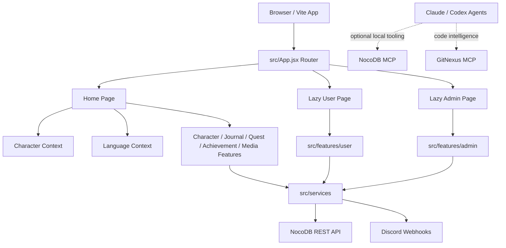

# Project Architecture

## Purpose

Meo's Journey is a React and Vite web application for a personal RPG-style character sheet, quest tracker, journal, photo album, and admin review workflow. The public home page presents the character profile and daily activity tabs. Protected user and admin pages handle updates, submissions, approvals, XP changes, and media uploads.

The project is optimized for a black-and-white sketch/game-art aesthetic, mobile-first layouts, and maintainable feature boundaries.

## Technology Stack

| Area | Technology |
| --- | --- |
| Frontend | React 19, React DOM |
| Routing | React Router DOM 7 |
| Build Tool | Vite 7 |
| Package Manager | pnpm |
| Primary Data Source | NocoDB REST API |
| Notifications | Discord webhooks |
| Deployment | GitHub Pages |
| Code Intelligence | GitNexus MCP |
| Database Agent Access | NocoDB MCP, local/private config |

## Runtime Surfaces

| Route | Purpose |
| --- | --- |
| `/` | Public character sheet with avatar, status, journal, quests, achievements, gallery, and photo album. |
| `/user/meos05` | Protected user update surface for profile/status/journal/media/task submissions. |
| `/admin/meos05` | Protected admin surface for quest/achievement management, approvals, XP updates, and auto-approve controls. |

`/user/meos05` and `/admin/meos05` are lazy-loaded in `src/App.jsx`. The page files under `src/pages/` are intentionally thin wrappers. Main implementations live in `src/features/user/` and `src/features/admin/`.

## High-Level Architecture



## Source Structure

```text
src/
|-- components/        # Shared UI, layout, modals, icon tools, common components
|-- config/            # Environment-backed constants
|-- contexts/          # Character and language providers
|-- data/              # Static fallback data for the home page
|-- features/          # Domain features grouped by responsibility
|-- hooks/             # Cross-feature hooks such as useCharacterData
|-- locales/           # Home page translations
|-- pages/             # Routed page wrappers
|-- services/          # NocoDB and Discord service layer
|-- styles/            # Global CSS
|-- utils/             # Date, journal, and quest journal helpers
|-- App.jsx            # Router setup, lazy route boundaries, home wiring
`-- main.jsx           # Vite entry point
```

## Feature Modules

| Module | Responsibility |
| --- | --- |
| `src/features/character/` | Home page character sections such as status, tabs, and daily activity composition. |
| `src/features/journal/` | Current journal and history tab UI. |
| `src/features/quests/` | Quest list and quest interaction UI. |
| `src/features/achievements/` | Achievement list and achievement modal UI. |
| `src/features/photoalbum/` | Photo album and gallery tabs, card/modal rendering, image browsing. |
| `src/features/user/` | Protected user update page, section components, user hooks, user CSS. |
| `src/features/admin/` | Protected admin management page, section components, admin hooks, admin CSS. |
| `src/features/auth/` | Password gate hook used by protected pages. |

## Page Composition

### Home Page

`src/App.jsx` wires the home route to `CharacterSheet` and wraps it with `CharacterProvider`. `CharacterSheet` composes:

- `Header`
- left sidebar: `Avatar`, `StatusBox`
- right content: `DailyActivities`
- `Footer`

`DailyActivities` owns the tab surface for journal, history, quests, achievements, photo album, and gallery.

### User Page

`src/pages/UserPage/` remains a wrapper. The actual page is in `src/features/user/components/UserPage.jsx`.

The user page is responsible for:

- profile and status updates
- daily journal entries
- quest and achievement proof submissions
- profile gallery uploads
- photo album uploads
- dirty-section tracking for faster submit behavior
- refresh events back to the home page

### Admin Page

`src/pages/AdminPage/` remains a wrapper. The actual page is in `src/features/admin/components/AdminPage.jsx`.

The admin page is responsible for:

- quest and achievement creation
- review and approval flows
- XP updates and level-up handling
- auto-approve controls
- pending confirmation review
- Discord admin notifications

## Data Layer

NocoDB is the primary data source. `src/data/characterData.js` is only fallback/default data for the public home page.

`src/services/nocodb.js` is a barrel export for modular service files:

```text
src/services/nocodb/
|-- core.js          # Base URL, token, table IDs, request throttling, retry, deduplication
|-- profile.js       # Profile, status, config data
|-- journals.js      # Journal and history records
|-- quests.js        # Quests and quest confirmations
|-- achievements.js  # Achievements and achievement confirmations
`-- media.js         # Gallery, photo album, storage upload handling
```

Keep runtime data access inside these service helpers. NocoDB MCP is for local agent operations such as live schema/record inspection, not browser runtime code.

## Environment Modes

The app uses different NocoDB table IDs by Vite mode:

| Mode | Table ID Set | Image Behavior |
| --- | --- | --- |
| `development` | `TABLE_IDS_DEVELOPE` | Uses local/signed paths and constructs full URLs when needed. |
| `staging` | `TABLE_IDS_STAGING` | Uses production-style signed URLs. |
| `production` | `TABLE_IDS_PRODUCTION` | Uses production signed URLs. |

Staging intentionally follows production image behavior. Do not treat staging like development for image URL logic.

## Home Data Flow

The home page uses a stale-while-revalidate style loading model:

1. Try to read `meo_home_data_snapshot` from `localStorage`.
2. If cache exists, render immediately with cached data.
3. If cache does not exist, show `LoadingDialog` until profile/status and avatar preload are ready.
4. Fetch profile and status first because they are critical for initial UX.
5. Load today's journals and config in the background.
6. Load quests and achievements in the background.
7. Store a short-lived non-sensitive home snapshot for faster repeat visits.

Avatar loading is handled in two layers:

- critical startup waits briefly for the avatar when there is no cache
- the `Avatar` component still shows an inline loading state while the image element finishes rendering

## Refresh Events

The app uses browser events to coordinate updates after user actions:

| Event | Purpose |
| --- | --- |
| `meo:refresh` | Forces home data refresh after user/admin changes. |
| `photoalbum:refresh` | Refreshes photo album data after upload. |

NocoDB request deduplication and throttling live in `src/services/nocodb/core.js`.

## Media Architecture

Photo album and gallery records are stored in NocoDB attachment tables and rendered by:

- `src/features/photoalbum/components/PhotoAlbumTab.jsx`
- `src/features/photoalbum/components/GalleryTab.jsx`

Both surfaces should show a note area even when the note is empty. Empty notes render a localized empty-note placeholder, while date/time still renders when available.

Image loading rules:

- development may need to construct URLs from `signedPath`, `path`, or `url`
- staging and production should prefer `signedUrl`
- nested relationship fetches are avoided when they hide or stringify attachment data
- map-based joins are preferred for related image/confirmation data

## Journal and Status Behavior

Status updates preserve the existing NocoDB status structure.

Status change history is written as one grouped `journals.caption` record per status submit. Multiple changed fields are represented as multiple lines inside that one journal entry. This keeps the database structure stable while reducing duplicate journal records.

## Notifications

Discord webhook helpers live in `src/services/discord.js`.

They are used for:

- user submissions
- admin-created quests or achievements
- approval/rejection flows
- XP and level-up events

Webhook configuration is intentionally kept separate from the NocoDB service layer.

## Styling Architecture

The UI follows a black-and-white sketch/game-art style.

Core rules:

- only black, white, and grayscale colors
- mobile-first responsive layout
- sketch fonts such as Patrick Hand, Kalam, and Architects Daughter
- thick black borders and solid black shadows
- subtle hand-drawn rotations
- minimum 44px touch targets

CSS organization:

| Area | Location |
| --- | --- |
| Global shared rules | `src/styles/global.css` |
| User page section CSS | `src/features/user/styles/` |
| Admin page section CSS | `src/features/admin/styles/` |
| Photo album/gallery CSS | Co-located with `PhotoAlbumTab` and `GalleryTab` |
| Component-specific CSS | Co-located with the component when practical |

Avoid adding generic class names such as `.container` or `.empty-message` inside component CSS. Prefer component-prefixed classes.

## Bundle and Performance Notes

Performance decisions currently in place:

- user/admin pages are lazy-loaded routes
- heavy home data loads in background after profile/status
- NocoDB calls are throttled and deduplicated
- simple user submits avoid unnecessary quest/achievement reloads
- `react-icons` usage is curated through `src/components/IconRenderer/iconRegistry.js`

When adding icons, add them to the registry instead of importing whole icon packs.

## Agent and Tooling Notes

This repository uses GitNexus for code intelligence. Agents should use GitNexus impact analysis before editing shared symbols and run change detection before commits.

NocoDB MCP is configured locally for Claude/Codex database inspection. It should be used only when live NocoDB data is needed. MCP tokens must never be written to documentation, commits, logs, or chat.

## Extension Guidelines

When extending the project:

1. Keep routed pages thin and put feature logic under `src/features/`.
2. Add service functions under `src/services/nocodb/` instead of growing unrelated components.
3. Preserve environment-specific table IDs and image URL behavior.
4. Prefer small section components and hooks over large page files.
5. Keep CSS scoped by feature or component.
6. Keep NocoDB record structures stable unless a migration is explicitly planned.
7. Test staging behavior for data and images before production-facing changes.
8. Update existing docs when architecture or maintenance rules change.
